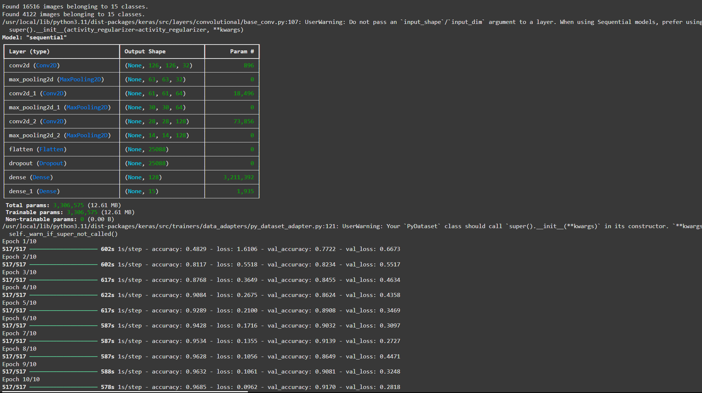
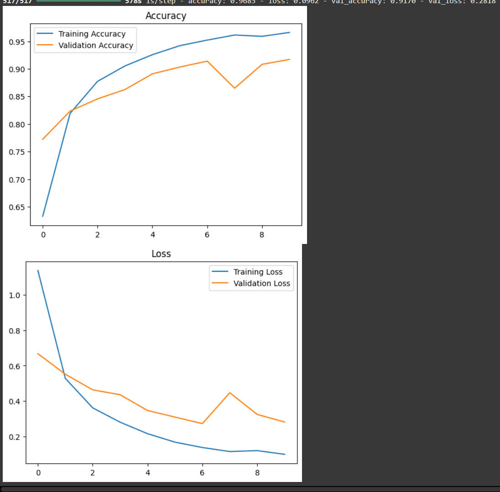

# 🌿 Plant Disease Detector using CNN

This deep learning project classifies plant leaf diseases using Convolutional Neural Networks (CNN) trained on the PlantVillage dataset. It can detect various diseases in tomato, potato, and pepper plants — helping farmers and agricultural experts in early diagnosis.

---

## 📷 Sample Output

### ▶️ Plant Disease Predictions
Here are a few predictions made by the model:

 


---

## 📁 Dataset

- **Source:** [PlantVillage Dataset](https://www.kaggle.com/datasets/emmarex/plantdisease)
- 15 classes:
  - Tomato (Early blight, Late blight, Healthy, Leaf Mold, etc.)
  - Potato (Healthy, Early blight, Late blight)
  - Pepper (Healthy, Bacterial spot)
- Image size: Resized to 128x128 for model input

---

## 🧠 Model Architecture

- Input: RGB images of size 128x128
- Layers:
  - Conv2D → ReLU → MaxPooling
  - Dropout for regularization
  - Flatten → Dense → Softmax
- **Optimizer:** Adam  
- **Loss Function:** Categorical Crossentropy
- **Metrics:** Accuracy

---

## 📊 Training Results

| Metric     | Value        |
|------------|--------------|
| Accuracy   | XX% (fill yours) |
| Loss       | XX           |
| Epochs     | 20           |
| Batch Size | 32           |

---

## 📦 Requirements

```bash
tensorflow
keras
matplotlib
numpy
pandas
scikit-learn
seaborn
Pillow
```

> Install using:  
> `pip install -r requirements.txt`

---

## 📂 Files

| File                             | Description                                      |
|----------------------------------|--------------------------------------------------|
| `Plant_Disease_Detector.ipynb`   | Complete model training and evaluation code      |
| `plant_disease_model.h5`         | Trained CNN model                                |
| `requirements.txt`               | List of required Python libraries                |
| `screenshots/`                   | Folder containing prediction outputs             |
| `README.md`                      | Project documentation                            |

---

## 🚀 Future Plans

- Deploy as a **mobile app** or **web application**
- Use **transfer learning** with models like MobileNetV2 or EfficientNet
- Add **real-time prediction** using device camera or webcam

---

## 🧑‍💻 Author

**Muhammad Rayan Shahid**  
AI & ML Enthusiast | [LinkedIn](https://www.linkedin.com/in/muhammadrayanshahid/) | [GitHub](https://github.com/RayanAIX)

---

⭐ If you found this project helpful, consider starring the repo!
